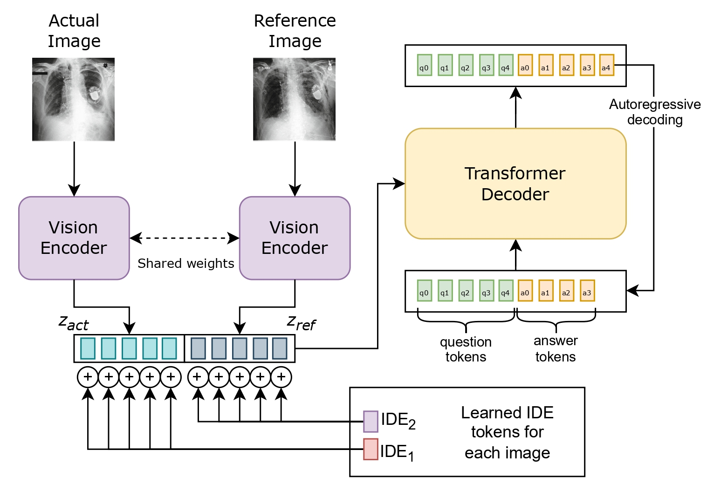

# Unveiling Differences: A Vision Encoder-Decoder Model for Difference Medical Visual Question Answering

**Official implementation of the paper**  
**_Unveiling Differences: A Vision Encoder-Decoder Model for Difference Medical Visual Question Answering_**



This repository provides the codebase for training and evaluating the **VED** model, a Vision Encoder-Decoder architecture specifically designed for Difference Medical Visual Question Answering (Diff-MedVQA). The task involves answering questions based on the differences between two medical images.

## 📦 Environment Setup

Follow these steps to prepare your environment:

```bash
# Create and activate a Conda environment

conda create -n mdvqa_env python=3.9
conda activate mdvqa_env
```

```bash
# Install core dependencies

pip install vilmedic==1.3.2
pip3 install torch==1.9.0+cu111 torchvision==0.10.0+cu111 torchaudio==0.9.0 -f https://download.pytorch.org/whl/torch_stable.html
pip install albumentations
```

```bash
# If there is any error related to the CV2 package:

pip uninstall -y opencv-python opencv-contrib-python opencv-python-headless 
pip install opencv-python==4.7.0.72
```

## 🔧 Configuration

Before starting training, **you must update the** `paths.py` **file** in the following directories to reflect the correct paths to your datasets and model directories:

- `Swin_Radiology_Finetune/paths.py`
- `Vision_Encoder_Decoder_MDiffVQA/paths.py`

## 🚀 Training workflow

The training process consistes of **three stages**:

### 🧠 Stage 1 - Finetune Swin Transformer

1. Go to the `Swin_Radiology_Finetune/` directory
2. Prepare your dataset using the notebook `prepare_data.ipynb`
3. Fine-tune the Swin Transformer with `python swin_finetune.py`
4. Analyze the training results with `python swin_finetune_analysis.py`

You can customize paremeteres such as learning rate, batch size and number of epochs directly in the scripts.

### 🤖 Stage 2 & 3: Train the Vision Encoder-Decoder (VED) Model

1. Navigate to `Vision_Encoder_Decoder_MDiffVQA/train/`
2. Edit the training files:
    - `nll_train.sh`: adjust epochs, learning rate, GPU settings, etc.
    - `mytrain_nll.py`: configure encoder freezing, loss functions and data paths
3. Start training with `bash nll_train.sh`

Track the logs and make adjustements as needed to optimize model performance

## 📄 Citation

If you use this repository or the model in your research, please cite the following paper:

```bibtex
@inproceedings{obrador-reina2025unveiling,
  title      = {Unveiling Differences: A Vision Encoder-Decoder Model for Difference Medical Visual Question Answering},
  author     = {Luis-Jesus Marhuenda and Miquel Obrador-Reina and Mohamed Aas-Alas and Alberto Albiol and Roberto Paredes},
  booktitle  = {Medical Imaging with Deep Learning},
  year       = {2025},
  url        = {https://openreview.net/forum?id=8CNssOg7fk}
}
```

---

📌 Última revisión: [Junio 2025]

